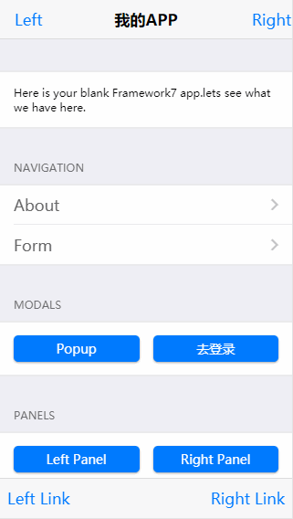

# 基于react iOS,Android端以及webap的开发基础脚手架
### 技术栈及环境
- `react@16.8.6+webpack@4.x+framework7-react@4.3.1`
- `node v8.6.0`
- `npm v5.3`

### 安装
- git clone 本项目
- npm install
- 开发：npm start
- 打包：npm run build

### 目录文件介绍

- .vscode  -- vscode编辑器相关配置
- app -- 源码
  - api -- api相关目录
    - base.js -- api基类，提供ajax方法以及返回数据判断
    - User.js -- 示例，和用户相关的api都在这里，如登录登出，可通过Mock装饰器模拟数据返回
  - components -- 存放公用组件
    - store -- 通过react的`context`实现的简版redux
  - config --  存放配置目录
    - base.js -- 基础配置，如api host，请求超时时间，菜单，启用Mock等
    - code.js -- 一些通用码配置
  - Mock -- 存放mock数据文件
    - base.js -- mock的返回数据判断
    - User -- 示例，用户类数据模拟
  - pages -- 存放页面业务逻辑
    - HomePage --首页
    - LoginPage --登录页
    - //...
  - resource -- 存放资源文件，如图片，视频等
  - style --  存放样式
    - base.less --基础样式，公共样式
    - index.less -- 样式统一入口
    - theme -- 主题目录，定义一些公共样式
    - login --登陆页面样式
  - utils -- 存放公用工具
    - ajax.js --ajax实现，采用`axios`库
  - client.js -- 入口文件
  - App.js -- App初始页及配置
  - index.html -- html模板文件
- scripts -- webpack打包工具配置脚本
- .babelrc.js -- babel配置文件，版本babel>=7
- .eslintrc.js -- eslint配置文件
- jsconfig.json -- 挡在webpack配置了`alias`时，这个文件可以解决导入相关包无法自动提示的问题（在vscode中可行）
- postcss.config.js -- postcss配置文件

### 支持浏览器
- 良好支持：**iOS7+,Android4.4+**

### 其它说明
- 有什么建议或问题随时和我交流

### 图片演示
